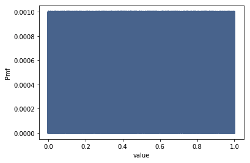
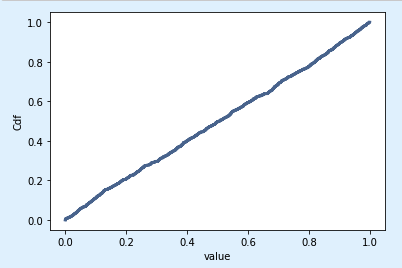

[Think Stats Chapter 4 Exercise 2](http://greenteapress.com/thinkstats2/html/thinkstats2005.html#toc41) (a random distribution)

#### Generate 1000 numbers from np.random.random and plot their PMF and CDF... is the distribution uniform?

```python
vals = np.random.random(1000)

thinkplot.Pmf(thinkstats2.Pmf(vals))
thinkplot.Config(xlabel='value',ylabel='Cdf')
```



This is the probability distribution. Every between 0 and 1 is equally probable (uniform).

```python
thinkplot.Cdf(thinkstats2.Cdf(vals));
thinkplot.Config(xlabel='value',ylabel='Cdf')
```


The distribution is uniform!

